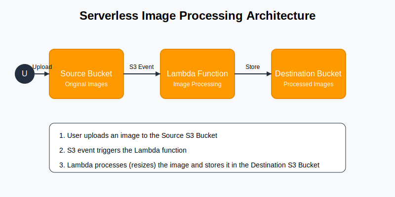

# Serverless Image Processing with AWS

This project implements a serverless image processing application using AWS services. Users can upload images to an S3 bucket, which triggers a Lambda function to process (resize) the images and store them in another S3 bucket.

## Architecture



- **Amazon S3**: Two buckets for storing original and processed images
- **AWS Lambda**: Executes image processing when new images are uploaded
- **IAM Roles**: Secure access between services

## Setup Instructions

### Local Testing

Before deploying to AWS, you can test the image processing functionality locally:

```bash
pip install -r requirements.txt
python test_locally.py your-image.jpg
```

### Deployment

1. Deploy using the provided script:
   - On Linux/Mac: `./deploy.sh`
   - On Windows: `deploy.bat`

   Or manually deploy the CloudFormation template:
   ```bash
   aws cloudformation deploy --template-file template.yaml --stack-name image-processor --capabilities CAPABILITY_IAM
   ```

2. Upload an image to the source bucket:
   ```bash
   aws s3 cp your-image.jpg s3://SOURCE_BUCKET_NAME/
   ```

3. Check the destination bucket for the processed image:
   ```bash
   aws s3 ls s3://DESTINATION_BUCKET_NAME/
   ```

## Project Structure

- `template.yaml`: CloudFormation template defining all AWS resources
- `src/`: Contains Lambda function code
  - `process_image.py`: Python code for image processing
- `architecture.svg`: Architecture diagram
- `requirements.txt`: Python dependencies for the Lambda function
- `deploy.sh`: Deployment script for Linux/Mac
- `deploy.bat`: Deployment script for Windows
- `test_locally.py`: Script to test image processing locally

## Learning Outcomes

- Building event-driven architectures with Lambda and S3 triggers
- Understanding cost-efficient, auto-scaling serverless applications
- Enhancing security using IAM roles and S3 bucket policies