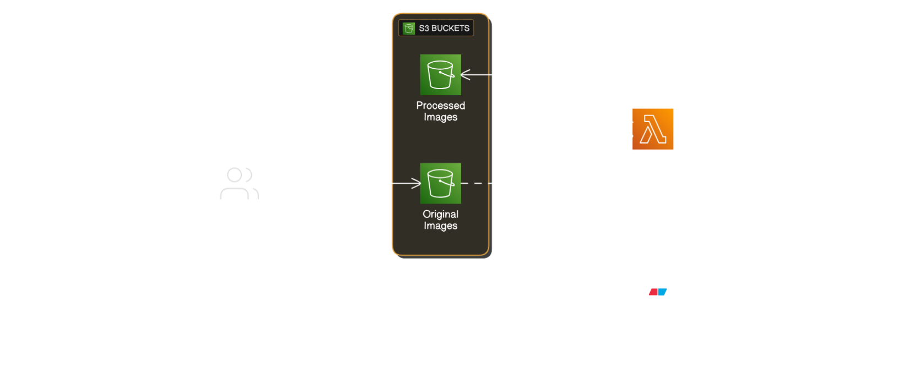

# Image Resizer Lambda

This Lambda will be invoked when a file is uploaded to a particular bucket. It will fetch the file that was added, resize it, and store the output in a different bucket.

## Architecture




https://github.com/user-attachments/assets/e2b76329-b534-4c44-9ac1-a69ceff431b1


- **Amazon S3**: Two buckets for storing original and processed images
- **AWS Lambda**: Executes image processing when new images are uploaded
- **IAM Roles**: Secure access between services

## Setup Instructions

## Run Locally

Clone the project

```bash
  git clone https://github.com/OneLightWebDev/image-resizer-lambda.git
```

Install Dependencies

```bash
# Required options if on mac
npm install --arch=x64 --platform=linux --target=16x sharp
```

## Environment Variables

Remember set the `DEST_BUCKET` in your Lambda's "Configuration" tab. To do this, open your Lambda in the AWS Console, select the "Configuration" tab, then click "Environment variables"

```bash
DEST_BUCKET=thumbnails-bucket-name
```

## Deployment

```bash
npm run package
```

Running the command above will zip your source code and dependencies. The zip can then be uploaded to your Lambda.


Credits to nikitadev-yt
https://github.com/nikitadev-yt/image-resizer-lambda/tree/main
